# comfyui-mute-bypass-by-ID

**mute or bypass any node in your workflow by its node ID or Name** — even nodes buried inside nested Subgraphs — from a single compact control node. The node toggles, and target pickers are standard ComfyUI widgets, so they can be **linked or promoted to Subgraph nodes** and used as top-level switches.

This pack includes **5 custom nodes**:

* **Mute Bypass by ID — Single**: mute/bypass 1 target, growable up to **20 targets** with the **+ Node** button.
* **Mute Bypass by ID — A/B**: toggle between two targets (A active mutes/bypasses B and vice-versa), growable up to **10 A/B pairs** with the **+ Pair** button. Includes a *node status* control to disable mute and bypass on the A and B nodes.
* **Mute Bypass by ID — Stacker**: a master control panel that lists your Remote Control nodes in one place, with per-row controls and a **global Mute / Bypass / User override**.
* **Mute Bypass by ID — Triple** *(legacy)*: mute/bypass any combination of 1–3 nodes. Kept for compatibility — use the growable Single node instead.
* **Mute Bypass by ID — AA/BB** *(legacy)*: switches two A/B pairs at once. Kept for compatibility — use the growable A/B node instead.

⭐ If these nodes save you time, a star helps other ComfyUI users find them.

---

## Installation

* **ComfyUI Manager**: search for `mute-bypass node by ID` and install.
* **comfy-cli**: `comfy node install comfyui-mute-bypass-by-ID`
* **Manual**: clone this repo into your `ComfyUI/custom_nodes` folder and restart ComfyUI.

All nodes appear under the **mute bypass by ID** category when adding a node.

---

## Node 1: Mute Bypass by ID — Single

Mute or bypass up to 20 nodes anywhere in your workflow with one switch.

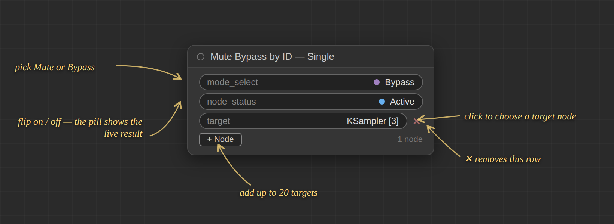

**Step by step:**

1. Add the node: right-click the canvas → *Add Node* → *mute bypass by ID* → **Mute Bypass by ID — Single**.
2. Click the **target** pill to open the picker. Search by node **name or ID**, or browse the groups — every Subgraph gets its own group, nested ones included.

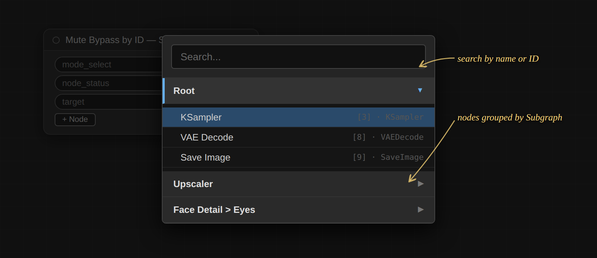

3. Pick the node you want to control. The pill now shows its title and ID path, e.g. `KSampler [3]`.
4. Set **mode_select** to *Mute* or *Bypass*.
5. Flip **node_status** to apply it. The pill always shows the live result: *Active*, *Muted*, or *Bypassed*.
6. Click **+ Node** to reveal more target rows (up to 20) — all targets follow the same switch. Click a row's **✕** to remove just that row; the rest shift up.

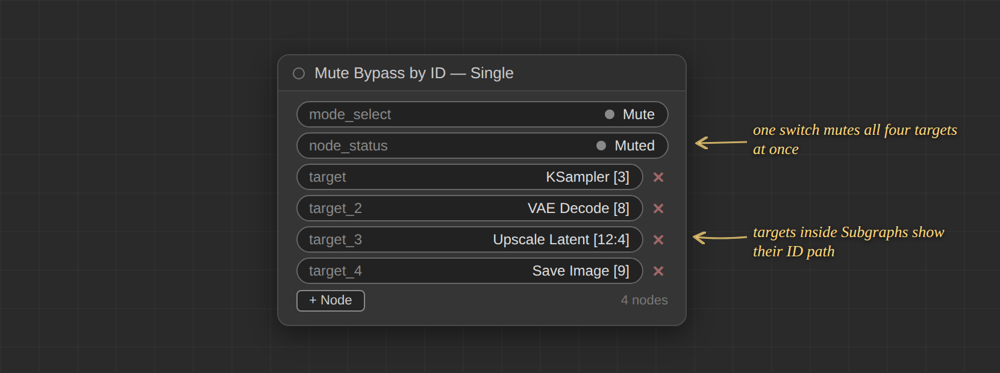

**Picking targets — search by name or by node ID:**

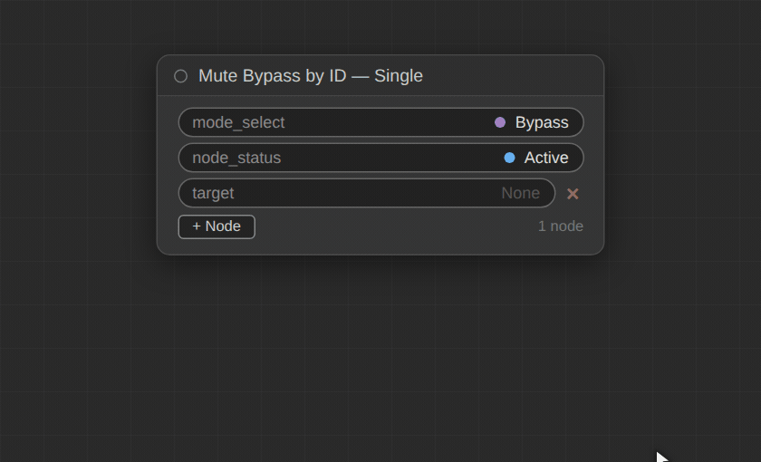

**Growing, switching, and removing rows:**

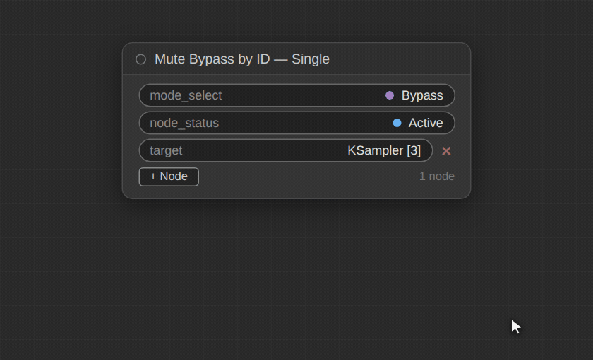

---

## Node 2: Mute Bypass by ID — A/B

Toggles between two targets: activating side A mutes/bypasses side B, and activating side B mutes/bypasses side A.

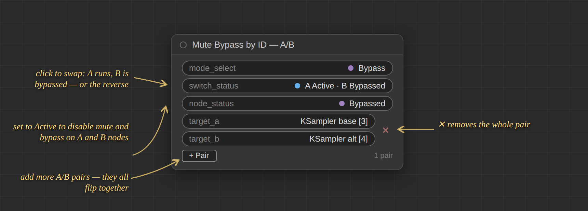

**Step by step:**

1. Add **Mute Bypass by ID — A/B** and pick a target for **target_a** and **target_b** using the picker.
2. Set **mode_select** to *Mute* or *Bypass* — this is what happens to the inactive side.
3. Click **switch_status** to swap sides. The pill reads out both sides, e.g. `A Active · B Bypassed`.
4. **node_status** — in its default state (*Muted / Bypassed*) the switch behaves normally: the inactive side is muted/bypassed. Set it to **Active** to disable mute and bypass on the A and B nodes, letting you temporarily run both branches without touching your wiring.
5. Click **+ Pair** to add more A/B pairs (up to 10) that all flip together with the same switch. Each pair has a **✕** that removes the whole pair.

**Switching sides, changing mode, adding and removing pairs:**

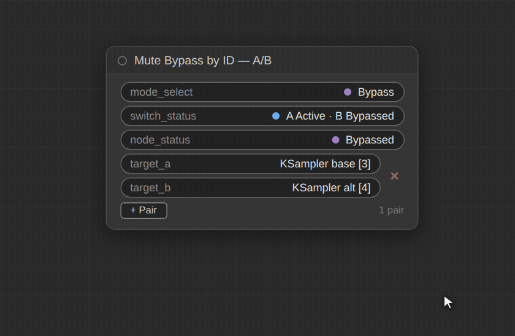

---

## Node 3: Mute Bypass by ID — Stacker

One node to rule them all. Drop a Stacker anywhere in your workflow and it becomes a control panel for your Remote Control nodes.

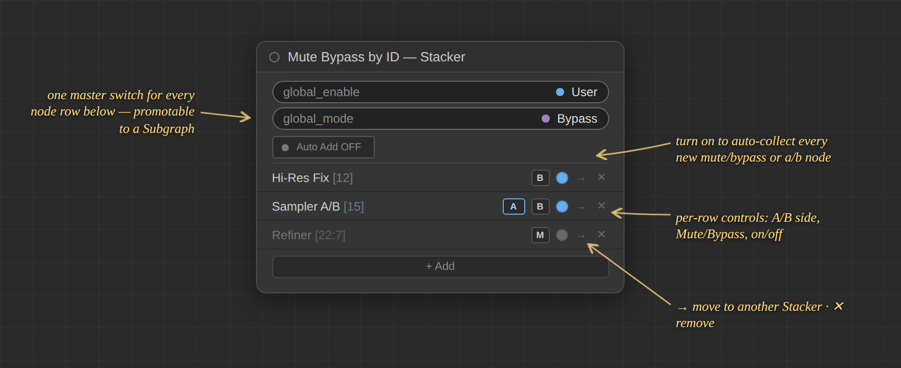

**Step by step:**

1. Add **Mute Bypass by ID — Stacker**. Click **+ Add** to pick existing mute/bypass and A/B nodes from a searchable list, or turn **Auto Add ON** to automatically collect every new one you create.
2. Each row shows the node's title, ID path, mode, and a state dot (blue = active, grey = muted, purple = bypassed). Control it right from the row: click the **dot** to toggle it, **M/B** to change its mode, and — for A/B nodes — the **A/B** button to flip sides. Note: the row buttons are panel controls, **not** widgets — they cannot be promoted or linked.
3. For a master override, flip **global_enable** from *user* to *global*: every owned node is muted or bypassed at once (pick which with **global_mode**). Flip back to *user* and every node returns to exactly the state it was in before, including A/B sides.
4. Only the two global toggles (**global_enable** and **global_mode**) are real widgets — these are the promotable/linkable part of the Stacker. Promote them to a Subgraph for a one-click master switch anywhere in your workflow.
5. Use **→** on a row to move it to another Stacker (run several to organize groups) and **✕** to remove it.

**Global override, per-row controls, removing and re-adding rows:**

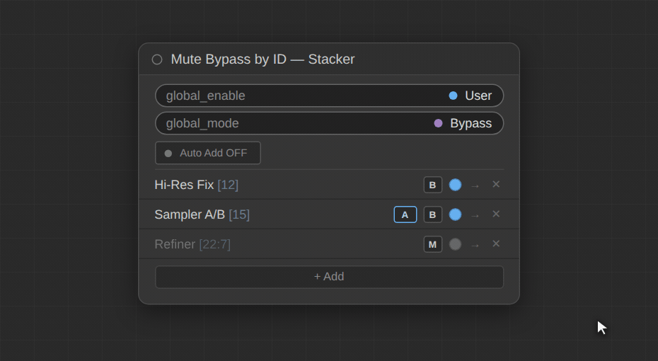

---

## Node 4: Mute Bypass by ID — Triple *(legacy)*

Works the same as the Single node, but with 3 fixed target slots. Kept only for old workflows — the Single node with **+ Node** covers this and more. It will be removed in a future update.

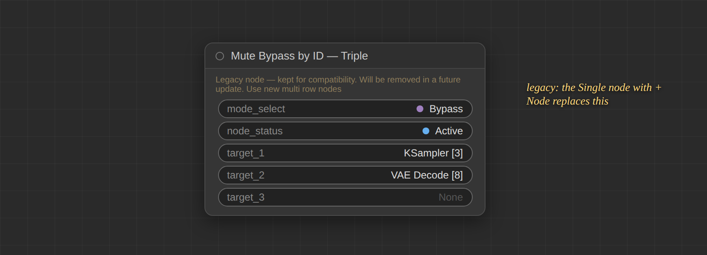

## Node 5: Mute Bypass by ID — AA/BB *(legacy)*

Same as the A/B node, but switches 2 fixed pairs at once. Kept only for old workflows — the A/B node with **+ Pair** covers this and more. It will be removed in a future update.

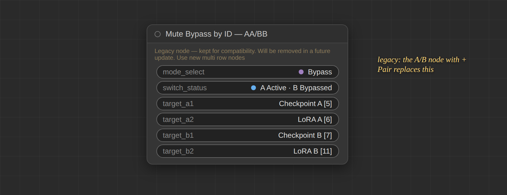

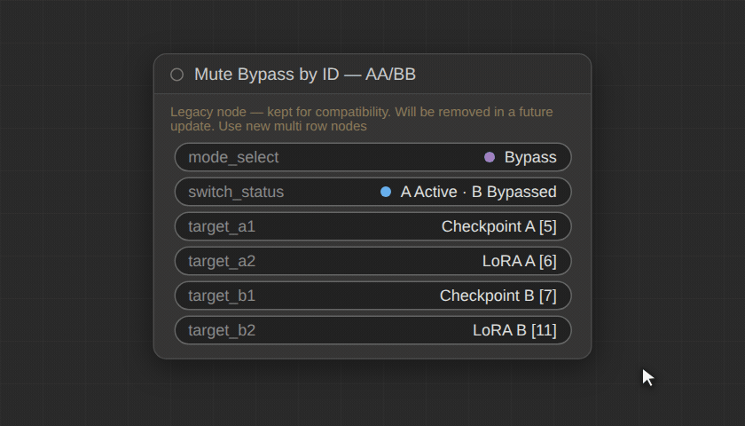

---

## Use Case Scenarios

* **Toggle save/preview branches** — mute your SaveImage / preview nodes while iterating, re-enable them for final output.
* **Control Subgraph internals from the top level** — target nodes nested deep inside Subgraphs by their ID chain, and promote the picker and toggles onto the Subgraph node itself so the whole thing behaves like a packaged switch.
* **One master panel** — with a Stacker (and promoted global toggles) you can bypass every optional branch in a big workflow for a fast test render, then restore everything to its exact previous state with one click.
* **Group toggling** — a single growable node with up to 20 targets can mute an entire "debug" set (notes, previews, comparisons) in one shot; multiple Stackers keep different groups organized.

---

## Changelog

**07/15/2026 — Version 3.0.0**

* **A/B switch: new *node status* toggle** — the same control as on the Single node. In its default state (*Muted / Bypassed*) the A/B switch works exactly like before: the inactive side is muted/bypassed. Set it to **Active** to disable mute and bypass on the A and B nodes. Existing A/B workflows load and behave identically.
* **Simplified controls** — the experimental per-row state and per-node master controls were rolled back to standard ComfyUI toggles, which promote and link to Subgraph nodes reliably across frontend versions.
* **Stacker: promotable global override** — the User/Mute/Bypass header buttons were replaced by two native toggles (*user/global* and *mute/bypass*). Promote them to a Subgraph node for a one-click master switch; promoted toggles stay in sync even when flipped through a link.
* **Stacker: full A/B control from the row** — flip the **A/B side** and toggle *node status* directly on the Stacker row. Switching back to *user* restores each node's exact previous state, including which side was active.
* **Stacker rows now show the full ID path** (e.g. `[209:25:103]`) next to the title, instead of a target count.
* **Auto Add now defaults OFF** — the Stacker only claims Remote nodes when you turn it on.
* **Cleanup of deleted and moved targets** — Remote nodes deleted from the graph are pruned from the Stacker after a short grace period instead of lingering as "(missing)" rows; nodes moved between Subgraphs keep working, their reference is fixed automatically.
* **Clearer status pills** — toggles now read out their real effect (*Active / Muted / Bypassed*) with mode colors (grey mute, purple bypass), and the A/B switch reads out both sides, e.g. `A Active · B Bypassed`.
* **Picker and pill display** — picker entries and target pills show the full ID path plus node type, and long values truncate from the left so the ID always stays visible.
* **Save/load hardening** — widget values are always serialized in the original declaration order and re-applied by name on load, so workflows from any version load correctly and undo/redo is safe.
* **Fixes** — stale Stacker saved-states from earlier builds are discarded so returning to *user* can't restore wrong values; the Stacker's background timer is stopped when the node is deleted (memory leak); ghost duplicate nodes in Subgraph scans are filtered out.
* **Security fix** — node/subgraph titles are HTML-escaped in the picker, preventing script injection from shared workflows.
* **UI tweaks** — "+ Target" renamed to **+ Node**; the separate "−" button was replaced by the per-row **✕**. Triple and AA/BB now show a legacy note and will be removed in a future update.

**01/16/2026 — Version 2.1.0**

* Custom UI was causing instability, reverted to standard ComfyUI widgets.
* After a widget has been selected, re-clicking the picker retains the path of the target.
* Since the node target path is retained in the picker, the path underneath the widget was removed to save space and remove clutter.
* Added target node ID path inside the picker, i.e. `[209:25:103]` → [subgraph : subgraph : node target].
* The picker is now linkable and promotable.
* The A/B switch does not visually turn off and on, but remains the same color to indicate that the node is still active.
* Multiple nodes with the same widget name no longer cause a conflict error when promoting or linking.

**12/29/2025 — Major Version Update V2.0.0**

* Reliably mutes or bypasses any node in any Subgraph using the Subgraph ID and Node ID together.
* ComfyUI can sometimes assign a duplicate ID to nodes in different Subgraphs — this update handles duplicate IDs correctly.

---

These nodes were made with love for personal use, but if you like this node set, feel free to buy me a coffee to help me stay up late lol 😂

⭐ And if they've earned a place in your workflow, a star helps other ComfyUI users find them.
